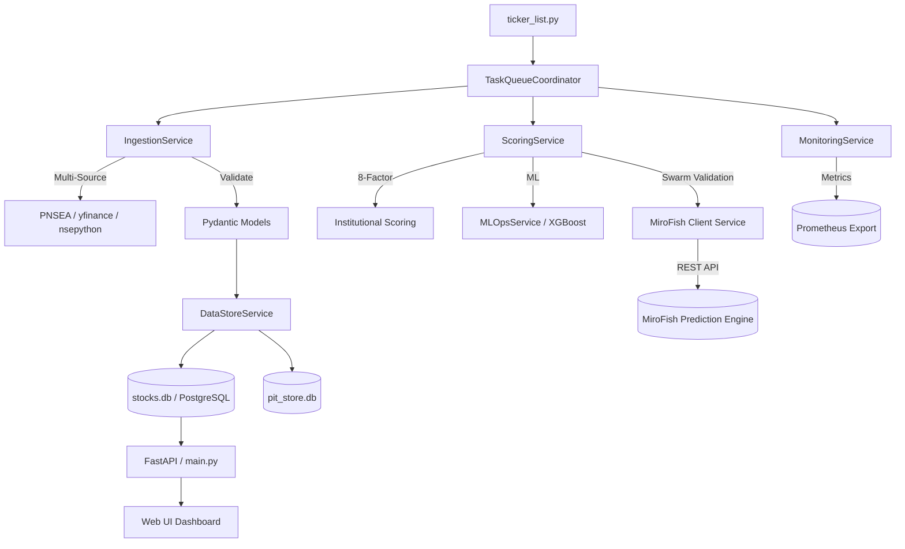

# 🏛️ Sovereign AI Trading Engine (v3.5 - Institutional Grade)

An institutional-grade quantitative screening and scoring ecosystem designed for the Indian (NSE) and Global (US) markets. This system bridges the gap between raw unstructured market data and high-conviction investment signals through a service-oriented validation pipeline.

---

## 📦 Two Editions

**Sovereign Lite** (default — this is what runs in the preview and is recommended for a single user on SQLite + yFinance):

- SQLite only (5 core tables + score history + quarterly results + MB candidate tracking + 5y financial history)
- **Two-tier universe**: curated **Core** (~155 names, daily scan) + **Discovery** (~590 names mined from the repo's NIFTY-500-style list, weekly scan) — both feed the same scoring/snapshots so multibaggers get found before they're obvious
- yFinance-only data layer (`lite/data.py`) — no API keys, no Redis/Celery, with a **Data Quality card** exposing per-field fundamentals coverage and **per-symbol failure tracking** (`failed_symbols` table: whole download chunks can no longer vanish silently — every failed name + error is recorded and surfaced on the dashboard)
- **SQLite tuned for concurrency**: WAL journal mode + `synchronous=NORMAL` (readers never block writers; scans/backtests/refreshes no longer lock each other out) and a **60s scan cooldown** to prevent accidental hammering
- **Discovery Engine** (`lite/discovery.py` + Discovery screen): Emerging Leaders ranked by an **orthogonal** discovery score (25% RS rank · 25% RS acceleration (1M−3M percentile) · 25% revision proxy · 15% margin expansion · 10% size factor, confidence-dampened) — momentum dropped because it double-counts trend with RS rank
- 7-screen React dashboard: Dashboard · Screener · Elite Picks · Discovery · Research · Portfolio · Backtest
- 5-factor regime-aware scoring (Quality/Growth/Momentum/Valuation/Risk) with a **dedicated revision-proxy factor** (EPS accel + revenue accel + margin expansion + CFO growth, 10% of the composite with its own attribution bar), **convex data-confidence dampening** ((coverage/100)^1.5 — 0% coverage scores 0, not 50%), multi-factor RS (1/3/6/12M percentiles) with an **RS-stability blend** (consistent 90/91/92/93 profiles beat erratic 20/10/99/15 ones at the same rank), **institutional quality** (5y stability), earnings-revision proxy + **quality-of-earnings** (CFO/PAT, CFO growth, **accrual ratio**), sector rotation (RS + growth + breadth + momentum) + a **Sector Breakout Monitor** (per-sector % of names near / in the new-high zone of their 52-week range, >50/200-DMA participation and median 3M return blended into a 0–100 breakout score — flagged ≥60 with ≥3 members, with per-sector leaders — Dashboard card + `/api/research/breakouts`), **Kelly-Lite 2.1** sizing (score × quality ÷ volatility × drawdown-penalty × **liquidity factor** — avg daily traded value log-scaled 0.2–1.0, so 95-scoring microcaps can't be oversized; per-stock vol/max-DD/liquidity persisted every scan) with **sector caps** + **factor-exposure** + **Portfolio Risk** readouts (diversification-adjusted portfolio vol, weighted max drawdown, HHI concentration, risk grade — on Dashboard + Portfolio), 100-Bagger Detector with MB v3 (incl. 5y **compounder** + **reinvestment scores**), one-click backtest + **walk-forward validation** (3×12-month folds with per-fold **universe size** + **pre-PIT flags**) + **Sortino/turnover/Universe-EW benchmark** + a realistic **transaction-cost model** (STT/brokerage/GST/SEBI/**stamp duty**/exchange charge/slippage, 0.25%/side floor) + **survivorship guard** (no backfilled listings) + a reserved **45-day fundamental publication lag** (documented for future fundamental-based strategies — the current momentum strategy is price-only), **real index benchmarks** (NIFTY 50 / NIFTY Midcap 150 / NIFTY Smallcap 250 stored point-in-time and refreshed every scan — every backtest reports return/CAGR/max-DD/Sharpe/Sortino/**alpha vs each index**, so the model is measured against the market, not just its own universe) and a **tax-aware rebalancing engine** (every scan persists the Kelly-Lite book as the baseline; the next plan diffs it — HOLD inside ±2% tolerance so winners are never sold to be re-bought, SELL/TRIM only on dropout or conviction loss with **real entry-price gains taxed as STCG (30%) or LTCG (10%) by holding period**, BUY for new names, sector caps re-checked, and an explicit **total drag % (tax + costs)** so a rebalance can be judged by its after-tax value — surfaced as the Rebalancer panel on the Portfolio screen with **rebalance execution tracking** (every plan is saved; mark it applied and the target book becomes the next baseline), **cash management** (regime/breadth buffers, wait-for-pullback staging for overextended names, thin-liquidity caps — Cash Plan card on Portfolio), and **per-sector budgets** (configurable per-sector caps on top of the global 25%, saved from the Portfolio screen)
- **Point-in-time by design — now enforced in backtests**: every scan snapshots universe membership (`universe_history`) and fundamentals as known that day (`fundamentals_history`); backtests consume both through `pit_loaders()` — candidates are restricted to the universe as of each rebalance date (a name can't trade in 2021 if the 2021 membership didn't include it, so delisted/replaced names from earlier snapshots still participate in their era) and optional fundamental floors (`min_roe` / `min_sales_growth`) are applied to data as known at rebalance date **minus the 45-day reporting lag** — today's ROE can never leak into a 2021 test; both screens report their coverage/exclusions in every run summary; market breadth adds 52-week **new highs/lows**; a long-format **`factor_scores`** table (symbol × scan_date × factor) is written every scan so factor research has clean panel data
- **Phase 14 data integrity**: **quarterly revision tracking** (when a new reported quarter appears, the revenue/PAT qoq change is logged as UPGRADE / DOWNGRADE / MIXED — a free-data proxy for earnings revisions, surfaced on the Research screen) and **NSE daily delivery position** (best-effort fetch of the public MA archive → `delivery_data` table → per-name accumulation signal, Dashboard card + refresh; the archive is anti-bot protected, so paste `SCRAPERAPI_KEY` into API Keys to route fetches through the ScraperAPI proxy)
- Explainable + self-measuring: **Explainability drawer** (click any Screener/Elite Pick row → `/api/explain/{symbol}`: rank, every factor contribution, best positive/negative reason, score trail sparkline), a dedicated **Research screen** (`/api/research/factors` factor IC ranked + alpha decay per horizon + **factor×factor correlation matrix** — the double-counting check, so quality and momentum can never silently become the same bet — plus **portfolio crowding** (the book's weighted percentile rank per factor *vs the whole universe*, with a ≥60 crowding flag), `/api/research/regimes` best factor per regime), **alpha decay** (7/30/90/180-day forward returns after signals), **factor IC** (which factor predicts returns, per regime, with learned weight tilt), a one-shot **`/api/overview`** aggregate, **market breadth** (% above 20/50/200-DMA + health score), and a **watchlist intelligence** feed (RS leaders, score surges, MB elites, top sectors) now on a dedicated **Ideas screen** (filterable feed, per-type daily counts, every event deep-linked into the explain drawer); the `/api/health` version comes from the single `lite.VERSION` source · `/api/explain/{symbol}` is hardened against bad input (unknown symbol → 404, missing fundamentals/factor history → empty payload, string-typed or corrupt `factor_contributions` coerced/normalized — a client can never see a raw KeyError/TypeError)
- 5y price history stored, so backtests and walk-forward folds cover real multi-year windows
- Entry point: `python3 lite_main.py` · deps: `requirements-lite.txt`

**Sovereign Pro** (optional, legacy enterprise stack) — moved to `pro/` (`pro/modules/`, `pro/worker/`, `pro/monitoring/`, `pro/api/`). XGBoost/SHAP hybrid scoring, Redis + Celery distributed workers, Prometheus observability, Alpha Vantage multi-source ingestion. Loaded only if you explicitly run the Pro entry points and install its deps — it is never imported by the Lite app:

```bash
pip install -r pro/requirements.txt
python3 pro/main.py          # legacy FastAPI engine (serves pro/web-ui)
python3 pro/sovereign-cli.py # ops CLI
```

---

## 💎 Core Investment Philosophy

The Sovereign Engine is built on the **"Quality at a Reasonable Price" (QARP)** principle, enhanced by **Momentum Alpha**. It filters out 99% of the market noise to find stocks exhibiting high return on capital, robust cash flows, and accelerating earnings momentum.

## 🧠 Hardened Scoring Methodology

The heart of the system is the `calculate_institutional_score` function in `modules/scoring.py`. This is a dynamic, regime-aware weighting engine that adapts to market conditions.

### 1. Factor Normalization & Splines
- **Sigmoid Normalization**: Every raw metric is passed through a `sigmoid-based normalization` (0-100) to prevent step-cliff biases.
- **Smooth Graduation Splines**: Replaced binary disqualifiers with continuous splines. A stock with 15.1% ROE no longer scores 20 points higher than one with 14.9%.
- **Deterministic Tie-Breaking**: Implemented a symbol-hash based microscopic epsilon (5-decimal precision) to ensure stable rankings for stocks with identical fundamentals.

### 2. The 8-Factor Model
| Factor | Default Weight | Why it Matters |
| --- | --- | --- |
| **Sales Growth** | 0.15 | Verifies top-line demand expansion. |
| **ROE Stability** | 0.15 | Measures capital efficiency and moat strength. |
| **Cash conversion** | 0.10 | Detects accounting red flags (CFO/PAT). |
| **Valuation Gap** | 0.15 | Graham / PEG Margin of Safety. |
| **EPS Velocity** | 0.10 | Identifies profit inflection points. |
| **F-Score** | 0.10 | 9-Pt Piotroski business health. |
| **Leverage** | 0.10 | Debt/Equity penalties (Sect-weighted). |
| **Momentum** | 0.15 | Relative Strength and technical trend. |

---

## 📈 Market Regime Architecture

The Sovereign Engine automatically switches between **four market regimes**, redistributing weights to match the environment:
- **BULL (Momentum)**: Aggressive growth priority (w_mom=0.35, w_eps=0.40).
- **BEAR (Value)**: Extreme focus on Graham floor and cash conversion (w_val=0.30).
- **SIDEWAYS (Balanced)**: Balanced focus on ROE and consistent sales.
- **QUALITY**: Prioritizes F-Score and CFO efficiency above all else.

---

## 📡 Observability & Monitoring

The engine is now fully instrumented for production-grade observability:
- **Prometheus Metrics**: High-resolution business metrics exposed via `/metrics`.
- **Latency Tracking**: Every Celery task is instrumented with timers to monitor pipeline throughput and data ingestion lag.
- **Data Quality (DQ) Guard**: Real-time tracking of fundamental data coverage and LLM thesis fallbacks.

---

## 🏗️ System Architecture

The trading engine follows a decoupled, **Service-Oriented Design** for maximum scalability.



### Swarm Intelligence Validation (MiroFish Integration)
Before taking a final position, high-conviction picks generated by the QARP/Momentum pipeline can be passed to our **Multi-Agent Simulation Layer**. Running `python scan_swarm.py --tickers ...` triggers a Swarm Intelligence debate via the MiroFish engine. Multiple AI agents parse contemporary news and fundamental data to battle-test the thesis, returning a finalized "Swarm Conviction Score."

---

## 🛡️ Security & Integrity

- **Environment Isolation**: API keys (Alpha Vantage) are never hardcoded. Missing keys trigger a hard-warning or disable downstream modules.
- **CORS Whitelisting**: The API serves only trusted origins defined in `.env`.
- **Database Abstraction**: Supports both **SQLite** (local dev) and **PostgreSQL** (production) via `DATABASE_URL` dynamic routing.
- **100% Test Coverage**: The core scoring engine passes a comprehensive unit test suite ([tests/test_scoring_engine.py](tests/test_scoring_engine.py)) with 35+ edge-case scenarios.

---

## 🛠️ Operational CLI (`sovereign-cli.py`)

- `health`: Run deep-forensic checks on env, deps, and connectivity.
- `ml-ops`: Monitor and update ML models (`--retrain`, `--update`).
- `tune-db`: One-click optimization for all SQLite databases.
- `db-stats`: Instant table audit and health overview.
- `regime`: Real-time diagnostic of market regime voting.

---

## ⚙️ Advanced Configuration (`config.py`)

| Key | Default | Purpose |
| --- | --- | --- |
| `DATABASE_URL` | env | Dynamic DB routing (PostgreSQL/SQLite). |
| `OLLAMA_URL` | env | Remote LLM gateway for thesis generation. |
| `CORS_ALLOWED_ORIGINS` | env | Comma-separated trusted web origins. |
| `MAX_SECTOR_EXPOSURE` | 0.25 | Prevents portfolio over-indexing. |
| `HARD_KILL_SWITCH_VIX` | 35.0 | Stops execution during extreme volatility. |

---

## 🚀 Getting Started

**Sovereign Lite (recommended — the default path):**

1. **Install**: `pip install -r requirements-lite.txt`
2. **Run**: `python3 lite_main.py` — dashboard at `:9005`, API at `/api/*`
3. **First scan**: hit **⟳ Run Scan** on the dashboard (fetches ~155 NSE names from yFinance, ~10s when cached)

**Sovereign Pro (legacy enterprise stack, optional):**

1. `pip install -r pro/requirements.txt`
2. `python3 pro/main.py` — legacy dashboard at `:9005`
3. Health check: `python3 pro/sovereign-cli.py health`

**Note for Contributors:** The Lite dashboard is a single file (`lite/web/index.html`, React via CDN). The legacy `pro/web-ui` frontend's `node_modules` is gitignored — run `cd pro/web-ui && npm install` if you touch it. Generated reports (`reports/`, `reports_cache/`) are gitignored.
